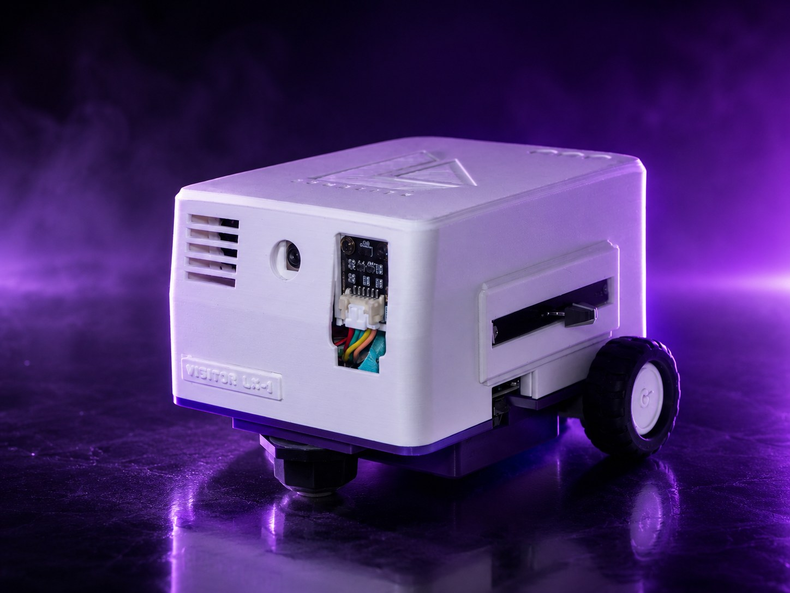
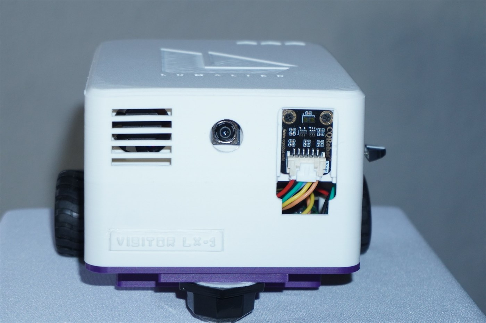
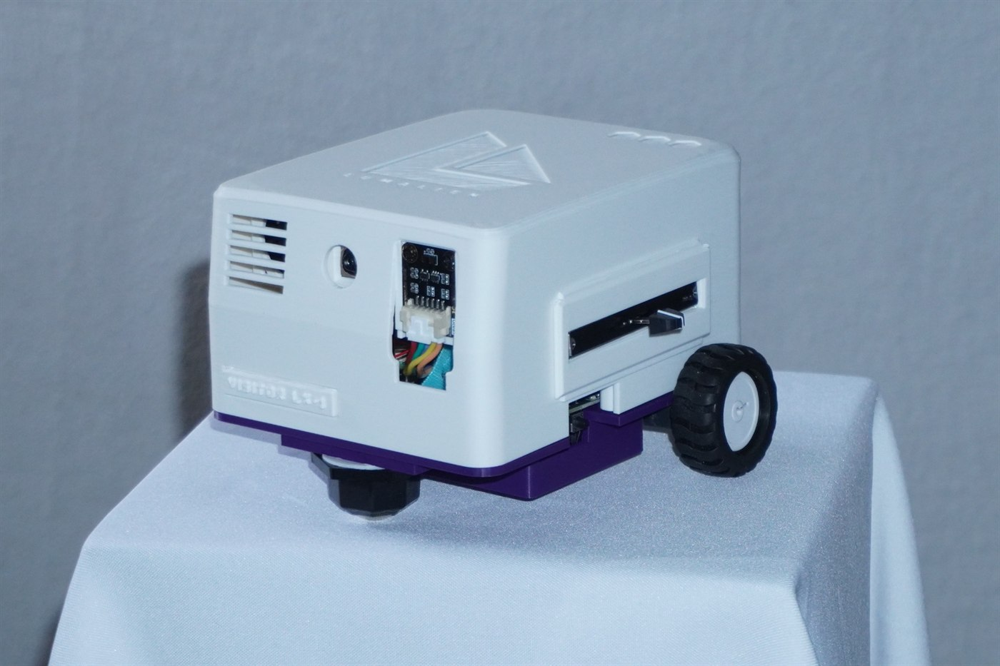
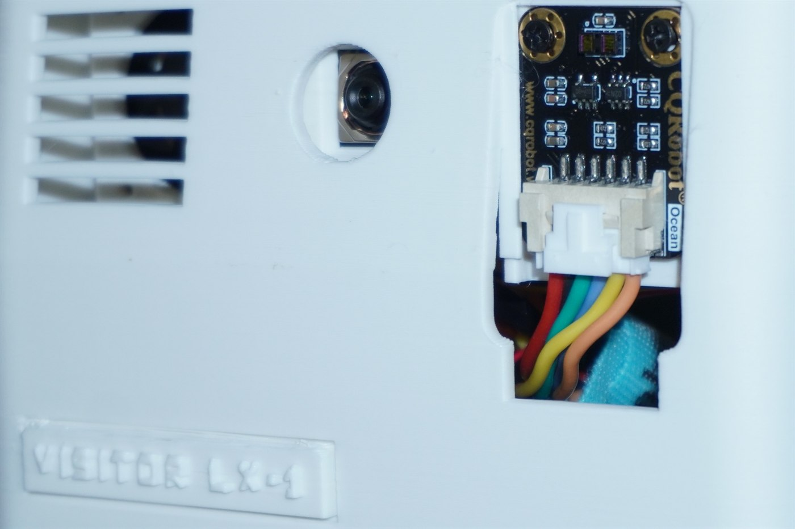
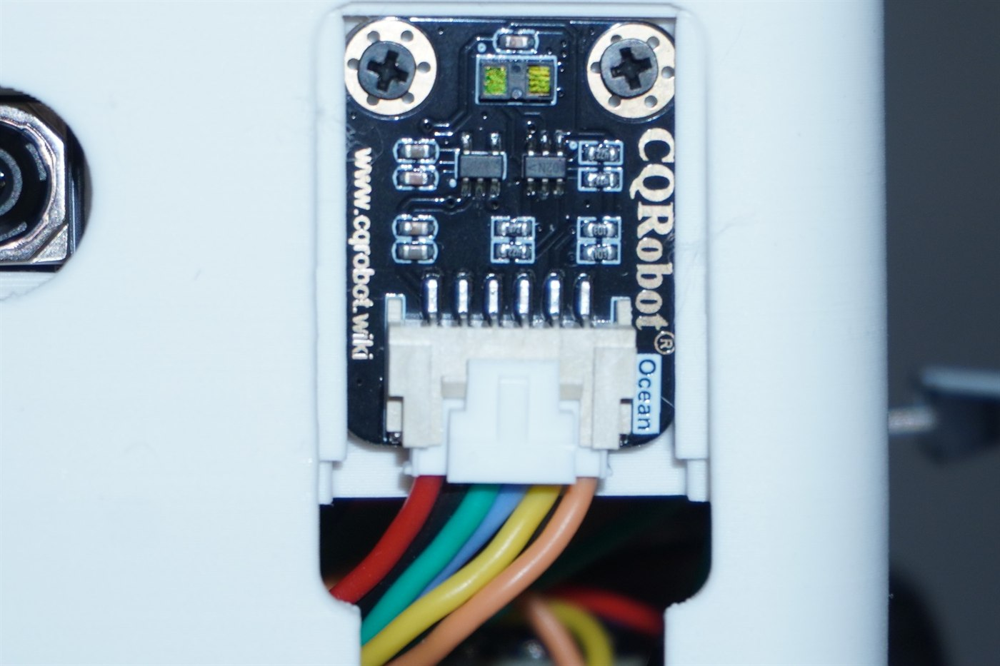
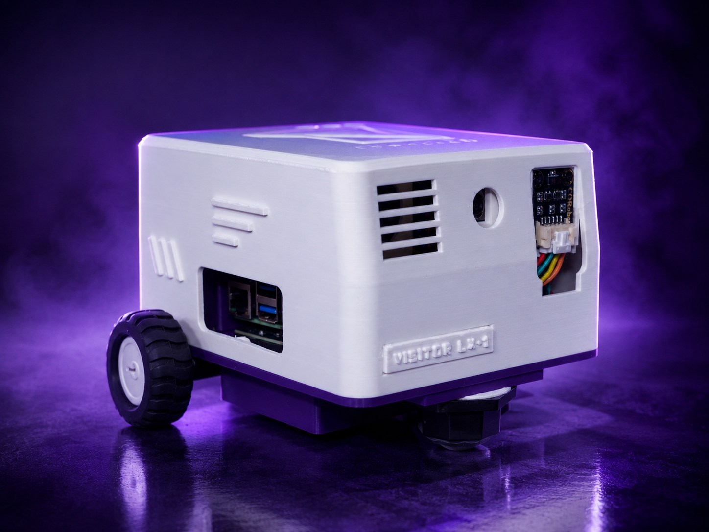

<div align="center">



# LumaBot

**The onboard brainstem of the VISITOR LX-1 Builders Edition.**<br>
Motors, sensors, LEDs, and camera on a Raspberry Pi 5 — with every reflex
running locally, whether or not the network is there.

[](https://www.raspberrypi.com/products/raspberry-pi-5/)
[](https://www.python.org/)


[](https://lumalien.com)

</div>

---

LumaBot is the hardware daemon for the **VISITOR LX-1 Builders Edition**
([lumalien.com](https://lumalien.com)). It owns the motors, sensors, LEDs, and
camera on a Raspberry Pi 5, runs all safety-critical behavior locally, and
exposes a small loopback HTTP API that
[LumaKit](https://github.com/patmakesapps/LumaKit) — the LLM agent — drives to
give the robot a mind.

The split is deliberate: **reflexes live here and never depend on Wi-Fi or a
model response.** Obstacle stops, watchdog timeouts, tilt cutoffs, collision
recovery, and battery gates all run in this daemon even if LumaKit dies
mid-command.

## Hardware

<table>
<tr>
<td width="50%"></td>
<td width="50%"></td>
</tr>
<tr>
<td align="center"><sub><b>Front.</b> Vent, NoIR camera, and the VL53L1X behind its cutout.</sub></td>
<td align="center"><sub><b>Three-quarter.</b> Printed shell over the purple chassis plate.</sub></td>
</tr>
</table>

| Part | Role |
|---|---|
| Raspberry Pi 5 | Runs the daemon (plus LumaKit on the same board) |
| 2× N20 gear motors + Adafruit Motor Bonnet (`0x60`) | Differential drive, rear caster |
| VL53L1X time-of-flight sensor (`0x29`) | Forward distance, ~27° cone, 10 Hz |
| MSA311 accelerometer | Tilt safety, collision detection, double-tap gesture |
| X1200 UPS + MAX17040 gauge (`0x36`) | Battery monitoring; motors run on a separate 6 V pack |
| Adafruit NeoSlider (`0x30`) | RGB status LEDs with a strict safety-first priority ladder |
| Pi NoIR camera (IMX708) | Still captures for LumaKit's vision tools |

Everything shares I2C bus 1; `i2c_bus.py` serializes access with one global
lock.

<table>
<tr>
<td width="50%"></td>
<td width="50%"></td>
</tr>
<tr>
<td align="center"><sub>The sensing face: camera and time-of-flight side by side.</sub></td>
<td align="center"><sub>VL53L1X on I2C — the reading every safety stop depends on.</sub></td>
</tr>
</table>

## Architecture

```text
server.py     Loopback HTTP API on 127.0.0.1:8971 (stdlib ThreadingHTTPServer)
daemon.py     100 Hz sense→decide→act control loop, gestures, safety stops
autonomy.py   Obstacle-avoidance state machine incl. sweep-and-commit escape
motors.py, distance.py, motion_sensor.py, battery.py, camera.py, indicator.py
              One module per device, each degrades to ready=False instead of
              crashing when hardware is absent
simulation/   Shared 2D world model (sensor cone, noise, dropout) + turtle sims
tests/        unittest suite; daemon tests require Pi-only smbus2
```

### HTTP API

| Method | Path | Purpose |
|---|---|---|
| GET | `/status` | Full robot status snapshot |
| POST | `/drive` | One leased move: `{direction, speed, duration_s}` (max 3 s — callers renew) |
| POST | `/stop` | Stop motors, cancel autonomy |
| POST | `/autonomy` | Start autonomous driving (only when every readiness check passes) |
| POST | `/camera/capture` | Take one still photo |
| POST | `/indicator/activity` | LumaKit's "thinking" LED lease |

The API binds loopback only and has no auth — do not port-forward it. LumaKit
runs on the same Pi and is the only intended client.

### Autonomous driving

Cruise at 70%, creep inside 500 mm, stop at 230 mm, then back up and turn.
Repeated trouble escalates: after a third recovery in ten seconds the robot
stops guessing and runs a **sweep-and-commit** escape — it pivots a full
scan, scores the distance profile for sustained clearance (distrusting the
sensor's synthetic "no target" reading), rotates back to the best direction,
and creeps out. A short episode memory penalizes directions that just
failed, and the controller's `episode_recoveries` counter is the planned
hook for asking LumaKit's camera for help when reflexes aren't enough (not
yet surfaced in `/status`). Full behavior
reference: [docs/autonomy.md](docs/autonomy.md).

Safety invariants, always: a missing or stale distance reading produces zero
motor output; control-loop errors and daemon shutdown coast the motors; tilt
≥55° stops motion; a ≥1 g impact triggers escalated recovery; double-tap the
chassis to toggle autonomy by hand.

## Simulation

No hardware needed:

```bash
python simulation/sim_autonomy.py   # watch the production controller escape a U-trap
python simulation/sim.py            # the legacy tutorial brain
```

`simulation/world.py` models the VL53L1X's 27° cone, 10 Hz refresh, gaussian
noise, grazing-angle signal dropout, and slight motor asymmetry, and is the
same model the escape regression tests drive.

## Tests

```bash
python -m unittest discover tests
```

Everything is hardware-free with injected fakes, except `tests/test_daemon.py`
which imports Pi-only `smbus2` — run the full suite on the Pi. One LumaKit-side
photo test likewise asserts POSIX file modes and only passes on Linux.

## Deploy (Raspberry Pi)



<sub>The rear cutout leaves the Pi 5's Ethernet and USB ports reachable — you can
flash, wire, and debug without opening the shell.</sub>

```bash
cd /home/lumabot21/lumabot
python -m venv .venv && .venv/bin/pip install -r requirements.txt
sudo cp lumabot.service /etc/systemd/system/
sudo systemctl enable --now lumabot.service
curl -fsS http://127.0.0.1:8971/status
```

Each subsystem is opt-in via environment (see `lumabot.service`):
`LUMABOT_MOTORS_ENABLED`, `LUMABOT_DISTANCE_ENABLED`, `LUMABOT_MOTION_ENABLED`,
`LUMABOT_BATTERY_ENABLED`, `LUMABOT_INDICATOR_ENABLED`,
`LUMABOT_CAMERA_ENABLED`, `LUMABOT_GESTURES_ENABLED`. First movement tests
should happen with the robot raised on a stand.

Pairing with LumaKit — modes, Telegram control, camera tools, and the agent
setup — is documented in LumaKit's
[`docs/lumabot_pi_setup.md`](https://github.com/patmakesapps/LumaKit/blob/main/docs/lumabot_pi_setup.md).

## More documentation

- [docs/autonomy.md](docs/autonomy.md) — driving behavior, corner escape, gestures, LED ladder
- [docs/project-context.md](docs/project-context.md) — full hardware build context and wiring
- [AGENTS.md](AGENTS.md) — collaboration style for AI-assisted development on this repo
